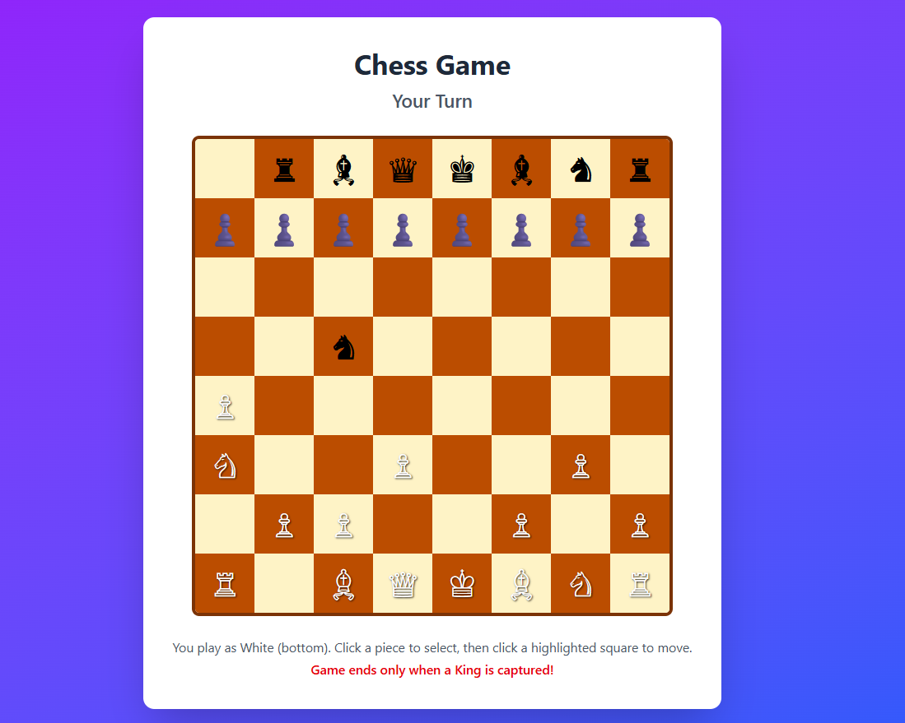
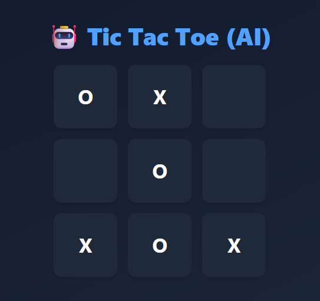
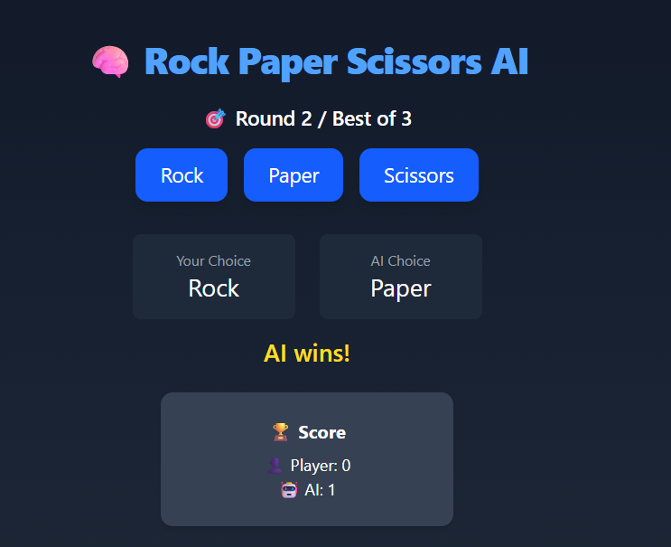

# 🎮 AI Games Collection

This project contains a collection of **AI-powered games** built with **Next.js**, **React**, and **Tailwind CSS**. Play against AI opponents powered by popular search and decision-making algorithms.

---
## 🚀 How to Run

1. **Clone the Repository**
   ```bash
   git clone <your-repo-url>
   cd my-games

## 📦 Project Overview

This app includes the following games:

✅ **♟️ Chess Game** (AI opponent using Minimax with Alpha-Beta pruning)  
✅ **✊✋✌️ Rock Paper Scissors** (AI predicts your next move)  
✅ **❌⭕ Tic Tac Toe** (Unbeatable AI with Minimax)  

Each game is implemented as a React component and styled with Tailwind CSS.

---

# 🎮 Classic Games Guide

Welcome to the Classic Games Guide! This `README` explains how to play three timeless games: **Chess**, **Tic Tac Toe**, and **Rock, Paper, Scissors**. Whether you're a complete beginner or just need a refresher, you're in the right place.

---

## ♟️ Chess

**Players:** 2  
**Goal:** Checkmate your opponent's king.

### 🧩 Basic Rules

- The game is played on an 8×8 board.
- Each player starts with 16 pieces:
  - 1 King 👑
  - 1 Queen 👸
  - 2 Rooks 🏰
  - 2 Bishops
  - 2 Knights 🐴
  - 8 Pawns

### 🔄 How to Play

1. **White moves first**, then players take turns.
2. Each type of piece moves in a specific way:
   - **Pawn:** Forward 1 square (first move can be 2), captures diagonally.
   - **Rook:** Straight lines (horizontal or vertical).
   - **Bishop:** Diagonals.
   - **Knight:** L-shape (2+1 squares), can jump over pieces.
   - **Queen:** Combines rook and bishop moves.
   - **King:** 1 square in any direction.

3. **Check:** King is under attack.
4. **Checkmate:** King cannot escape check — game over.
5. **Stalemate:** Draw if no legal moves but king is not in check.

---

## ❌⭕ Tic Tac Toe

**Players:** 2  
**Symbols:** X and O  
**Goal:** Get three of your marks in a row (horizontal, vertical, or diagonal).

### 🧩 How to Play

1. The game is played on a 3×3 grid.
2. Players take turns marking a square.
   - One player is **X**, the other is **O**.
3. The first player to get 3 in a row wins.
4. If all 9 squares are filled with no winner, the game is a **draw**.


---

## ✊✋✌️ Rock, Paper, Scissors

**Players:** 2  
**Goal:** Beat your opponent with the right choice.



### ✋ Rules

Each player chooses one of the following:

- **Rock** 🪨 beats Scissors (crushes them)
- **Scissors** ✂️ beats Paper (cuts it)
- **Paper** 📄 beats Rock (covers it)

### 👊 How to Play

1. Both players say “Rock, Paper, Scissors, Shoot!” and reveal their choice.
2. Compare results:
   - Same choice = **Draw**
   - Otherwise = **Winner** determined by the rules above.

---

## 📌 Notes

- These games are great for improving **strategy**, **focus**, and **quick thinking**.
- You can play them on paper, online, or with any physical or digital board.

---

> Have fun playing and mastering the classics!
